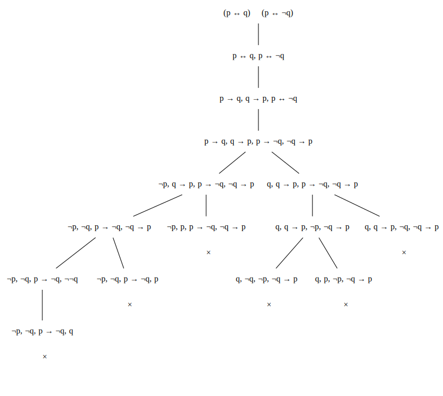
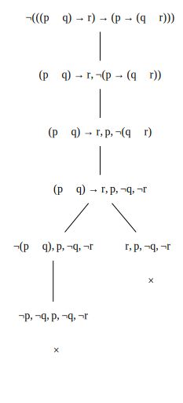
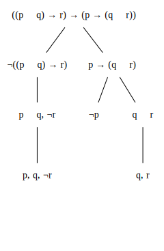
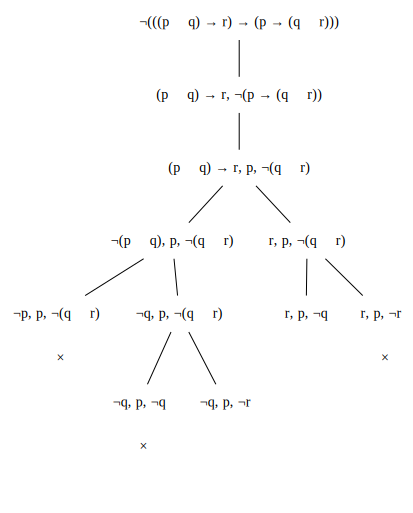

## Question 1

### 1 (i)

$p$|$q$|$\neg q$|$p\leftrightarrow q$|$p\leftrightarrow \neg q$|$(p\leftrightarrow q)\land (p\leftrightarrow \neg q)$
:-:|:-:|:-:|:--:|:--:|:----:
T|T|F|T|F|F
T|F|T|F|T|F
F|T|F|F|T|F
F|F|T|T|F|F

\
If a formula is unsatisfiable, it means that it is $false$ in all possible interpretations. It can be seen from the last column of the truth table that it is impossible for both $(p\leftrightarrow q)$ and $(p\leftrightarrow \neg q)$ to hold simulataneously. This makes sense because the first conjunct is $true$ only when the atoms $p$ and $q$ have the same truth value but the second conjunct is $true$ only when $p$ and $q$ have different truth values. This results in all possible interpretations leading to a value of $false$ and so the formula is unsatisfiable.

### 1 (ii)

$p$|$q$|$r$|$p\lor q$|$q\lor r$|$(p\lor q)\to r$|$p\to(q\lor r)$|$((p\lor q)\to r)\to (p\to(q\lor r))$
:-:|:-:|:-:|:--:|:--:|:-------:|:-------:|:--------------------:
T|T|T|T|T|T|T|T
T|T|F|T|T|F|T|T
T|F|T|T|T|T|T|T
T|F|F|T|F|F|F|T
F|T|T|T|T|T|T|T
F|T|F|T|T|F|T|T
F|F|T|F|T|T|T|T
F|F|F|F|F|T|T|T

\
For a formula to be valid, it must be $true$ under every possible interpretation. Also, by the rules for implication, a formula of the form $p\to q$ can only be $false$ when $p$ is $true$ and $q$ is $false$.

Given the formula $$((p\lor q)\to r)\to (p\to(q\lor r))$$ it is clear from the truth table that there is no possible interpretation where the antecedent $(p\lor q)\to r$ is $true$ and the consequent $p\to(q\lor r)$ is $false$, and so the formula is valid.

.
\
\
\
\

### 1 (iii)

$p$|$q$|$r$|$p\land q$|$q\land r$|$(p\land q)\to r$|$p\to(q\land r)$|$((p\land q)\to r)\to (p\to(q\land r))$
:-:|:-:|:-:|:--:|:--:|:-------:|:-------:|:--------------------:
T|T|T|T|T|T|T|T
T|T|F|T|F|F|F|T
T|F|T|F|F|T|F|F
T|F|F|F|F|T|F|F
F|T|T|F|T|T|T|T
F|T|F|F|F|T|T|T
F|F|T|F|F|T|T|T
F|F|F|F|F|T|T|T

\
The requirement for a formula to be satisfiable is that it needs to be $true$ in at least one interpretation. Similarly, for a formula to be falsifiable, there needs to be at least one interpretation where it is $false$.

Looking at the truth table for the formula $$((p\land q)\to r)\to (p\to(q\land r))$$ we can see that the last column of the truth table contains both $T$ and $F$ values, which indicates that the formula is both satisfiable (where the truth value is $T$) and falsifiable (where the truth value is $F$). A further implication of this is that the formula is not valid.

## Question 2

### 2 (i)

To show that $(p\leftrightarrow q)\land (p\leftrightarrow \neg q)$ is unsatisfiable, we need to prove that it is $false$ in all interpretations. To do this we will use proof by contradiction.

Assume that there is some interpretation $\mathscr{I}$ such that the formula is satisfiable. i.e. $v_\mathscr{I}((p\leftrightarrow q)\land (p\leftrightarrow \neg q))=T$

1. Then, by the defintion of $\land$, we have $v_\mathscr{I}(p\leftrightarrow q)=T\space ^{(1)}$ and $v_\mathscr{I}(p\leftrightarrow\neg q)=T\space ^{(2)}$
1. Then, by the definition of $\leftrightarrow$, for $^{(1)}$ we have that $v_\mathscr{I}(p) = v_\mathscr{I}(q)$ and,
1. By the definition of $\leftrightarrow$, for $^{(2)}$ we have that $v_\mathscr{I}(p) = v_\mathscr{I}(\neg q)$

But this leads to a contradiction where $v_\mathscr{I}(p)$ equals both $v_\mathscr{I}(q)$ and $v_\mathscr{I}(\neg q)$.

This means that our original assumption must be incorrect and so the formula is unsatisfiable.\

### 2 (ii)

To show that the formula $((p\lor q)\to r)\to (p\to(q\lor r))$ is valid, we need to prove that it is $true$ in all interpretions. To do this, we will use proof by contradiction.

Assume that there is some interpretation $\mathscr{I}$ such that the given formula is falsifiable, i.e. $v_\mathscr{I}(((p\lor q)\to r)\to (p\to(q\lor r))) = F$.

1. Then, by the defintion of $\to$, we have that $v_\mathscr{I}((p\lor q)\to r)=T\space^{(1)}$ and $v_\mathscr{I}(p\to(q\lor r))=F\space^{(2)}$
1. Then, by the definition of $\to$ for $^{(2)}$ we have that $v_\mathscr{I}(p)=T$ and $v_\mathscr{I}(q\lor r)=F$
and, by the definition of $\lor$ we have that $v_\mathscr{I}(q)=F$ and $v_\mathscr{I}(r)=F$
1. Then, by the definition of $\to$ for $^{(1)}$ we have three possible cases:

    1. $v_\mathscr{I}(p\lor q)=F$ and $v_\mathscr{I}(r)=F$ but by the definition of $\lor$ we have that $v_\mathscr{I}(p)=F$ and $v_\mathscr{I}(q)=F$ which leads to a contradiction on $v_\mathscr{I}(p)$.
    1. $v_\mathscr{I}(p\lor q)=F$ and $v_\mathscr{I}(r)=T$ which leads to a contradiction on $v_\mathscr{I}(r)$.
    1. $v_\mathscr{I}(p\lor q)=T$ and $v_\mathscr{I}(r)=T$ which again leads to a contradiction on $v_\mathscr{I}(r)$.

In all three cases we reach a contradiction so it must be that our assumption is incorrect so the formula is not falsifiable and is therefore valid.

## Question 3

We are to prove that if a sub-tree $\mathscr{T_n}$ which is rooted at a node $n$ of $\mathscr{T}$ is closed, then the set of formulas which label $n$ are unsatisfiable.

We show this by induction on the structure of $\mathscr{T}$, particularly the height of the node $n$, denoted $h_n$.

1. For the base case, we need to show that the property holds for any closed subtree of height $0$, i.e. those which consist of a single closed leaf node. This is trivial to show as it is clear that if a leaf node closes, then it must be labeled by a complimentary pair of literals and so it must be labeled by an unsatisfiable set of formulas.

2. For the inductive step we must then show that for any subtree with height greater than $0$, if the subtree is closed, then it implies that the set of labels on any node which is not a leaf node must also be unsatisfiable. We prove this by showing that any child node could only have been created by applying either an $\alpha$ or a $\beta$ rule to its parent node, and, because the child node(s) is closed and labeled by unsatisfiable formulas (by virtue of the inductive hypothesis), we can show by proof by cases that the parent node either directly contains a formula which is unsatisfiable, or that elements from the labels on the child node(s) can be composed (via conjunction or disjunction) into a formula which is unsatifiable.

## Question 4

### 4 (i)

In order to prove unsatisfiability, we need to show that all branches of the tableau of the formula are closed.\

All branches of the tableau are closed so we have proven that the formula is unsatisfiable.

### 4 (ii)

In order to prove validity, we must show that the tableau for the negation of the formula is unsatisfiable (closed).\
{ height=80% }

All branches of the tableau for the negated formula are closed and so we conclude that the original formula is valid.

### 4 (iiia)

In order to prove satifiability, we must show that at least one branch of the tableau is open.\
{ height=66% }

We have found at least one open branch and so we have proven the formula is satisfiable.

### 4 (iiib)

In order to prove falsifiability, we must show that the tableau for the negation of the formula has at least one open branch.\
{ height=66% }

We have shown that at least one branch of the tableau for the negated formula is open and so the original formula is falsifiable.

## Question 5

We identify the axioms to start with using the tableau generated in 4(ii).

$\space$|$\space~~~~~~~~~~~~~~~~~~~~~~~~~~~~~~$
:---------------------------------------------|-----------------------------------------------:
1. $\vdash\neg r, \neg p, q, r$|Axiom
2. $\vdash p, q, \neg p, r$|Axiom
3. $\vdash p\lor q,\neg p, r$|$\alpha\lor$, 2
4. $\vdash\neg((p\lor q)\to r),\neg p, q, r$|$\beta\to$, 3, 1
5. $\vdash\neg((p\lor q)\to r),\neg p, q\lor r$|$\alpha\lor$, 4
6. $\vdash\neg((p\lor q)\to r),p\to(q\lor r)$|$\alpha\to$, 5
7. $\vdash((p\lor q)\to r)\to(p\to(q\lor r))$|$\alpha\to$, 6
