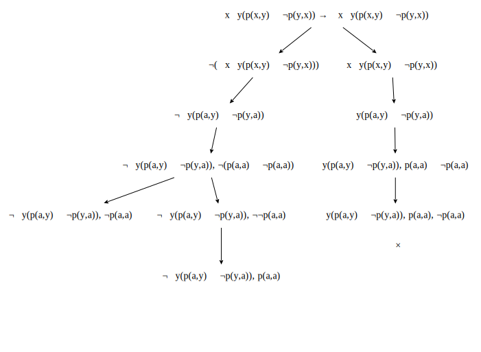

## Question 1

### 1 (i)

To show that $\exists x\neg(p(x)\rightarrow q(x))\rightarrow\neg(\exists xp(x)\rightarrow \forall xq(x))$ is valid, we need to prove that it is $true$ in all interpretations. To do this we will use proof by contradiction.

Assume that there is some interpretation $\mathscr{I}$ such that the formula is unsatisfiable. i.e. $v_\mathscr{I}(\exists x\neg(p(x)\rightarrow q(x))\rightarrow\neg(\exists xp(x)\rightarrow \forall xq(x)))=F$

1. By the truth values of implication, this means we have $v_\mathscr{I}(\exists x\neg(p(x)\rightarrow q(x)))=T$ and $v_\mathscr{I}( \neg(\exists xp(x)\rightarrow \forall xq(x)))=F$
1. For the antecedent, theorem 7.22 states there must be some assignment $\sigma_\mathscr{I}$ such that $v_{\sigma_\mathscr{I}}(\neg(p(x)\rightarrow q(x)))=T$, which, by the truth values of negation, gives us $v_{\sigma_\mathscr{I}}(p(x)\rightarrow q(x))=F$.
1. This (again by the truth values of implication) gives us $v_{\sigma_\mathscr{I}}(p(x))=T$ and $v_{\sigma_\mathscr{I}}(q(x))=F$ for some assignment $\sigma_\mathscr{I}$. This means that we have $v_\mathscr{I}(\exists xp(x)) = T$ (using theorem 7.22).
1. For the consequent, we have $v_\mathscr{I}(\exists xp(x)\rightarrow \forall xq(x))=T$ (negation). But we have already shown $v_\mathscr{I}(\exists xp(x)) = T$, so by implication we have $v_\mathscr{I}(\forall xq(x))=T$.
1. Using theorem 7.22 we then have that for all assignments $\sigma_\mathscr{I}$, $v_{\sigma_\mathscr{I}}(q(x))=T$. But we have found at least one assignment $\sigma_\mathscr{I}$ where $v_{\sigma_\mathscr{I}}(q(x))=F$ which leads to a contradiction.

Thus our original assumption that there is some $\mathscr{I}$ where the the formula is $false$ is incorrect and so by the truth value of negation the formula must be valid.

### 1 (ii)

We will show that $\exists x\exists yp(x,y)\leftrightarrow\forall x\forall y\neg p(x,y)$ is unsatisfiable by direct proof. i.e. we will show that the formula is $false$ in all interpretations.

Let $\mathscr{I}$ be an arbitrary interpretation where $\exists x\exists yp(x,y)$ is $true$. Then we have

$$\begin{aligned}
v_\mathscr{I}(\exists x\exists yp(x,y))=T&\iff v_{\sigma_\mathscr{I}}(p(x,y))=T\text{ for some assignments $\sigma_\mathscr{I}$\phantom{cm}(semantics of $\exists$)}\\
&\iff v_{\sigma_\mathscr{I}}(\neg p(x,y)) = F\text{ for some assignments $\sigma_\mathscr{I}$\phantom{4}(truth values of negation)}\\
&\iff\text{it is not the case that }v_{\sigma_\mathscr{I}}(\neg p(x,y))=T\text{ for all assignments $\sigma_\mathscr{I}$}\\
&\iff\text{it is not the case that $v_\mathscr{I}(\forall x\forall y\neg p(x,y)) = T$ (semantics of $\forall$)}\\
&\iff\text{$v_\mathscr{I}(\forall x\forall y\neg p(x,y))=F$}\\
\end{aligned}
$$

In a similar fashion, we again let $\mathscr{I}$ be an arbitrary interpretation where $\forall x\forall y\neg p(x,y)$ is $true$. We then have

$$\begin{aligned}
v_\mathscr{I}(\forall x\forall y\neg p(x,y))=T&\iff\text{$v_{\sigma_\mathscr{I}}(\neg p(x,y))=T$ for all assignments $\sigma_\mathscr{I}$\phantom{cm}(semantics of $\forall$)}\\
&\iff\text{$v_{\sigma_\mathscr{I}}(p(x,y))=F$ for all assignments $\sigma_\mathscr{I}$\phantom{9cm}(truth values of negation of $\forall$)}\\
&\iff\text{it is not the case that $v_{\sigma_\mathscr{I}}(p(x,y))=T$ for some assignments $\sigma_\mathscr{I}$}\\
&\iff\text{it is not the case that $v_\mathscr{I}(\exists x\exists yp(x,y))=T$\phantom{1}(semantics of $\exists$)}\\
&\iff\text{$v_\mathscr{I}(\exists x\exists yp(x,y))=F$}
\end{aligned}
$$

We have thus shown that in an arbitrary interpretation, whenever we have that $\exists x\exists yp(x,y)$ is $true$ then we have that $\forall x\forall y\neg p(x,y)$ is $false$ and, conversely, whenever $\forall x\forall y\neg p(x,y)$ is $true$ then $\exists x\exists yp(x,y)$ is $false$. As per the definition of equivalence, this is exacly the case when the truth value of $\exists x\exists yp(x,y)\leftrightarrow\forall x\forall y\neg p(x,y)$ is $false$ and so we have shown that the formula is unsatisfiable.

## Question 2

### 2(i)

With $p \leftarrow strange, q \leftarrow odd, r \leftarrow distinct\_divisors$ we can represent the formula as $$\forall x(p(x) \leftrightarrow \exists y(r(x,y)\land q(y)))$$

The above formula states that for all natural numbers $x$, if $x$ is $strange$ then there is some natural number $y$ which is $odd$ and also distinctly divides $x$. Working from the other direction, it states that for all natural numbers $x$, if there is some natural number $y$ which distinctly divides $x$ and is $odd$, then the number $x$ is strange.

### 2(ii)

Let $\mathscr{I} = (\mathbb{N}, \{odd, even, divides\}, \emptyset)$

Then, assigning $p \leftarrow odd, q \leftarrow even, r \leftarrow divides$ in the formula provided in (i), we have that a number is odd iff it is divisible by some even number, which is not possible. For example, $2k+1 \neq 2n.m$ for any $m,n,k \in \mathbb{N}$ so choosing an odd number, say $45$, we can see that none of its divisors $\{1, 3, 5, 9, 15, 45\}$ are even, which makes the forumala false and so it is therefore falsifiable.

## Question 3

### 3(i)

### 3(ii)

If under an arbitrary interpretation $\mathscr{I}$, the truth value of a formula $\exists xA(x)$ is $false$, then that means that for all $d \in D$ in the domain of $\mathscr{I}_A$ there is no assignment $\sigma_{\mathscr{I}_{A}}[x_i \leftarrow d_i]$ which will make $v_{\sigma_{\mathscr{I}}}(\exists xA(x))=T$.

Because $v_{\sigma_{\mathscr{I}}}(\exists xA(x))=T$ iff $\{A(d_1)\lor A(d_2)\lor \mathellipsis \lor A(d_i)\} =T$ and we have that $v_{\sigma_{\mathscr{I}}}(\exists xA(x))=F$ it must be that $v_{\sigma_{\mathscr{I}_A}}A(x_i)=F$ for all elements $d \in D$, with $\sigma_{\mathscr{I}_{A}}[x_i \leftarrow d_i]$.

\
\
\
\
\
\
\
\
\
\
\
\
\
\

## Question 4

### 4(i)

In order to show the validity of the formula, we show that the tableau for  negation of the formula is closed and thus unsatisfiable.\
{ height=50% }

All branches of the tableau for the negated formula are closed and so we conclude that the original formula is valid.

### 4(ii)

In order to prove unsatisfiability, we need to show that all branches of the tableau of the formula are closed.\

All branches of the tableau are closed so we have proven that the formula is unsatisfiable.

## Question 5

### 5(i)

In order to prove satisfiability, we need to show that the tableau of the formula is not closed.\

At least one of the branches of the tableau are open so we have proven that the formula is satisfiable.

### 5(ii)

In order to prove falsifiability, we need to show that the tableau of the negated formula is satisfiable (open).\

All branches of the tableau are open so we have proven that the negated formula is satisfiable and so the original formula is falsifiable.

## Question 6

We identify the axioms to start with using the tableau generated in 1(i).

$\space$|$\space~~~~~~~~~~~~~~~~~~~~~~~~~~~~~~$
:---------------------------------------------|-----------------------------------------------:
1. $\vdash\neg p(a), q(a), p(a), \exists xp(x)$|Axiom
2. $\vdash \neg p(a), q(a), \neg q(a), \neg\forall xq(x)$|Axiom
3. $\vdash \neg p(a), q(a), \exists xp(x)$|$\gamma\exists$, 1
4. $\vdash\neg p(a), q(a), \neg\forall xq(x)$|$\gamma\forall$, 2
5. $\vdash\neg p(a), q(a), \neg(\exists xp(x) \rightarrow \forall xq(x))$|$\beta\rightarrow$, 3, 4
6. $\vdash p(a)\rightarrow q(a), \neg(\exists xp(x) \rightarrow \forall xq(x))$|$\alpha\to$, 5
7. $\vdash \neg\neg(p(a)\rightarrow q(a)), \neg(\exists xp(x) \rightarrow \forall xq(x))$|$\alpha\neg$, 6
8. $\vdash \neg\exists x\neg(p(x)\rightarrow q(x)), \neg(\exists xp(x) \rightarrow \forall xq(x))$|$\delta\exists$, 7
9. $\vdash \exists x\neg(p(x)\rightarrow q(x)) \rightarrow \neg(\exists xp(x) \rightarrow \forall xq(x))$|$\alpha\rightarrow$, 8
